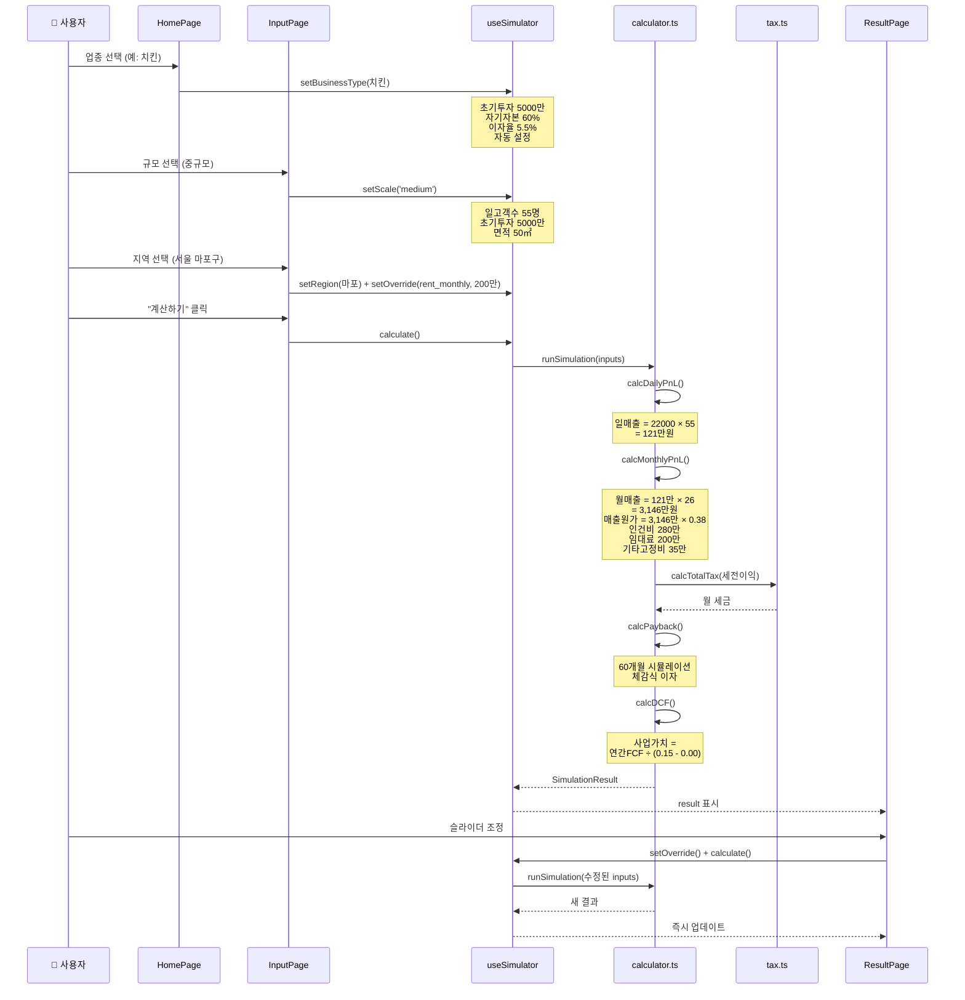

# 데이터 플로우 트리

> 어떤 데이터가 어디서 오고, 어떤 로직을 거쳐, 어디에 표시되는지를 시각화합니다.

---

## 1. 전체 데이터 흐름도

```mermaid
graph TD
    subgraph "데이터 소스"
        LOCAL_BT["📁 businessTypes.ts<br/>14개 업종 데이터"]
        LOCAL_CI["📁 costItems.ts<br/>89개 비용 항목"]
        LOCAL_RG["📁 rentGuide.ts<br/>50개 지역 임대료"]
        LOCAL_FC["📁 franchiseData.ts<br/>프랜차이즈 비용 폴백"]
        SUPA["☁️ Supabase<br/>(선택사항)"]
        FTC_PDF["📄 FTC 정보공개서 PDF<br/>→ parse-ftc-pdf.mjs<br/>→ franchise_costs 테이블"]
    end

    subgraph "데이터 페칭 레이어"
        FETCH["supabase.ts<br/>fetchBusinessTypes()<br/>fetchCostItems(id)<br/>fetchRentGuide()<br/>fetchFranchiseCosts(btId)"]
    end

    subgraph "훅 레이어"
        H_BT["useBusinessTypes<br/>→ businessTypes[]"]
        H_CI["useCostItems<br/>→ costItems[]"]
        H_RG["useRentGuide<br/>→ sidos, getRent()"]
        H_FC["useFranchiseCosts<br/>→ brands[], loading"]
        H_SIM["useSimulator<br/>→ inputs, result,<br/>setters, calculate()"]
    end

    subgraph "앱 오케스트레이터"
        APP["App.tsx<br/>상태 관리 + 네비게이션"]
    end

    subgraph "페이지"
        HOME["HomePage<br/>업종 선택"]
        INPUT["InputPage<br/>규모/지역/자본 입력"]
        RESULT["ResultPage<br/>4개 탭 결과"]
    end

    subgraph "계산 엔진"
        CALC["calculator.ts<br/>runSimulation()"]
        TAX["tax.ts<br/>calcTotalTax()"]
    end

    LOCAL_BT --> FETCH
    LOCAL_CI --> FETCH
    LOCAL_RG --> FETCH
    LOCAL_FC --> FETCH
    SUPA -.->|env 설정시| FETCH
    FTC_PDF -.->|스크립트로 업로드| SUPA

    FETCH --> H_BT
    FETCH --> H_CI
    FETCH --> H_RG
    FETCH --> H_FC

    H_BT --> HOME
    H_CI --> APP
    H_RG --> APP
    H_SIM --> APP

    APP -->|businessTypes| HOME
    APP -->|inputs, rentGuide| INPUT
    APP -->|result, costItems| RESULT

    INPUT -->|setScale, setCapital,<br/>setRegion| H_SIM
    INPUT -->|calculate()| CALC

    CALC --> TAX
    CALC -->|SimulationResult| H_SIM

    RESULT -->|setOverride +<br/>recalculate| CALC
```

## 2. 사용자 선택 → 계산 → 결과 흐름



## 3. 데이터 소스 트리 (정적 데이터)

```
src/data/
├── businessTypes.ts (14개 업종)
│   ├── 각 업종 필드:
│   │   ├── avg_ticket_price ──────────→ 일 매출 계산의 기본 객단가
│   │   ├── material_cost_ratio ───────→ 매출원가율 (매출 × 이 비율 = 원가)
│   │   ├── avg_daily_customers_{scale} → 규모별 기본 일 고객수
│   │   ├── labor_cost_monthly_per_person → 인건비
│   │   ├── misc_fixed_cost_monthly ───→ 기타고정비
│   │   ├── initial_investment_{scale} ─→ 규모별 초기투자 기본값
│   │   ├── initial_investment_min/max ─→ 슬라이더 범위
│   │   ├── avg_monthly_revenue_min/max → HomePage 카드 표시용 (계산 미사용)
│   │   ├── closure_rate_{1yr/3yr/5yr} ─→ 표시용 (계산 미사용)
│   │   └── data_sources ──────────────→ 출처 기관명 (표시용)
│   │
│   └── 사용처: HomePage (카드 표시) + useSimulator (계산 입력)
│
├── costItems.ts (89개 비용 항목)
│   ├── 각 항목 필드:
│   │   ├── business_type_id ──→ 업종 연결
│   │   ├── category ──────────→ material/labor/rent/utilities/equipment/marketing/other
│   │   ├── amount_monthly_min/max → 참고 범위
│   │   ├── is_initial_cost ───→ 초기비용 여부
│   │   └── note ──────────────→ 설명 텍스트
│   │
│   └── 사용처: ResultPage > PnLDisplay > SGADetail (참고 표시만, 계산 미사용❗)
│
├── rentGuide.ts (50개 지역)
│   ├── 각 지역 필드:
│   │   ├── sido + sigungu ────→ 지역 선택 드롭다운
│   │   ├── rent_per_sqm ──────→ 월임대료 = rent_per_sqm × scaleSqm
│   │   ├── deposit_per_sqm ───→ 저장만, 계산 미사용❗
│   │   └── data_quarter ──────→ "2025Q1" (표시용)
│   │
│   └── 사용처: InputPage > RegionSelector (임대료 계산)
│
└── franchiseData.ts (프랜차이즈 비용 로컬 폴백)
    ├── Supabase franchise_costs 테이블의 로컬 미러
    ├── 각 브랜드 필드:
    │   ├── brand_name ──────────→ 브랜드명
    │   ├── franchise_fee ───────→ 가맹비 (원)
    │   ├── education_fee ───────→ 교육비 (원)
    │   ├── deposit ─────────────→ 보증금 (원)
    │   ├── total_cost ──────────→ 초기비용 합계 (원)
    │   ├── interior_per_33sqm ──→ 인테리어 3.3㎡당 (원)
    │   ├── interior_total ──────→ 인테리어 총액 (원)
    │   ├── royalty_rate ────────→ 상표사용료 (%, 매출 대비)
    │   └── advertising_rate ────→ 광고분담금 (%, 매출 대비)
    │
    ├── 데이터 수집 파이프라인:
    │   FTC PDF 다운로드 → parse-ftc-pdf.mjs → .parsed-costs.json → --upload → Supabase
    │
    └── 사용처: InvestmentBreakdownStep (브랜드별 비용 비교), FranchiseSearch
```

## 4. 사용자 입력 → 계산 매핑

```
사용자 입력                        계산에서의 역할
─────────────────────────────────────────────────────────
업종 선택        ──→ 객단가, 재료비율, 고객수, 인건비, 기타고정비 결정
규모 (소/중/대)  ──→ 고객수 기본값 선택 + 면적(33/50/66㎡) 결정
지역 선택        ──→ ㎡당 임대료 → 월 임대료 자동 계산
초기투자금       ──→ 대출금 = 초기투자 - 자기자본
자기자본         ──→ 대출금 계산 + 자기자본비율
이자율           ──→ 월 이자비용 계산
대출기간         ──→ 월 원금상환액 계산

[ResultPage 오버라이드]
일 고객수 조정   ──→ 매출 재계산 (즉시)
객단가 조정      ──→ 매출 재계산 (즉시)
월 임대료 조정   ──→ 판관비 재계산 (즉시)
할인율 조정      ──→ DCF 사업가치 재계산 (즉시)
성장률 조정      ──→ DCF 사업가치 재계산 (즉시)
```

## 5. 계산하지 않지만 표시하는 데이터

| 데이터 | 출처 | 표시 위치 | 비고 |
|---|---|---|---|
| 월매출 범위 (min/max) | businessTypes | HomePage 카드 | 참고용 |
| 폐업률 (1/3/5년) | businessTypes | HomePage 카드 | 참고용 |
| 비용항목 상세 (89개) | costItems | ResultPage SGADetail | 참고용 힌트 |
| 보증금 (원/㎡) | rentGuide | 미표시 | 데이터만 존재 |
| 데이터 출처 기관명 | businessTypes | 미표시 | 부록 문서용 |
| 데이터 분기 | rentGuide | 미표시 | 부록 문서용 |
