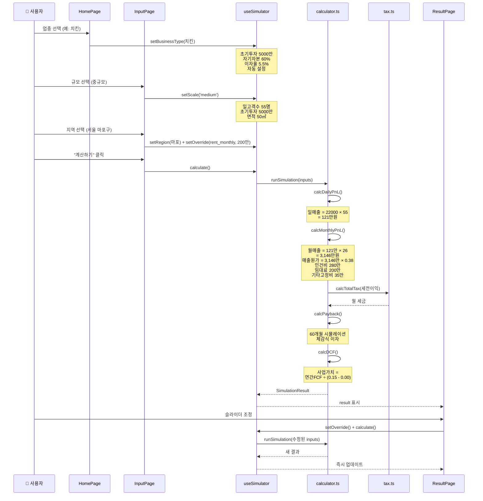

# 데이터 출처 문서화 + 디자인 워크플로우 + 데이터 플로우 시각화 Implementation Plan

> **For Claude:** REQUIRED SUB-SKILL: Use superpowers:executing-plans to implement this plan task-by-task.

**Goal:** 3가지 산출물을 만든다: (1) 인앱 부록용 데이터 출처/계산식 문서, (2) 디자인 작업 가이드, (3) 데이터 플로우 시각화

**Architecture:** Task 1-5는 데이터 출처 문서 작성, Task 6은 디자인 가이드 문서, Task 7은 데이터 플로우 다이어그램. 모두 `docs/` 폴더에 마크다운으로 작성하며, Task 1-5의 결과물은 나중에 인앱 부록 페이지로 변환 가능.

**Tech Stack:** Markdown, Mermaid (데이터 플로우 다이어그램)

---

## Task 1: 세금 계산 출처 문서 작성

**Files:**
- Create: `docs/APPENDIX-DATA-SOURCES.md` (이 파일에 모든 출처를 누적 작성)

**Step 1: 세금 구간 출처 섹션 작성**

아래 내용을 `docs/APPENDIX-DATA-SOURCES.md`에 작성:

```markdown
# 부록: 데이터 출처 및 계산 방식

> 이 문서는 자영업 수익 시뮬레이터에서 사용하는 모든 데이터의 출처, 기준 시점, 계산 방식을 정리한 것입니다.
> 사용자가 직접 검증하고 재계산할 수 있도록 상세히 기술합니다.

---

## 1. 세금 계산

### 1.1 종합소득세 구간세율 (2025년 기준)

| 과세표준 구간 | 세율 | 누진공제액 |
|---|---|---|
| 1,400만원 이하 | 6% | 0원 |
| 1,400만원 초과 ~ 5,000만원 이하 | 15% | 126만원 |
| 5,000만원 초과 ~ 8,800만원 이하 | 24% | 576만원 |
| 8,800만원 초과 ~ 1.5억원 이하 | 35% | 1,544만원 |
| 1.5억원 초과 ~ 3억원 이하 | 38% | 1,994만원 |
| 3억원 초과 ~ 5억원 이하 | 40% | 2,594만원 |
| 5억원 초과 ~ 10억원 이하 | 42% | 3,594만원 |
| 10억원 초과 | 45% | 6,594만원 |

**출처:** 국세청 종합소득세 세율표
**확인 방법:** [국세청 홈택스](https://www.nts.go.kr) → 세금신고 → 종합소득세 → 세율 안내
**기준 시점:** 2025년 귀속분 (소득세법 제55조)
**코드 위치:** `src/lib/tax.ts` 7~16행

### 1.2 지방소득세

- **세율:** 종합소득세의 10%
- **출처:** 지방세법 제91조
- **확인 방법:** [위택스](https://www.wetax.go.kr) → 지방소득세 안내
- **코드 위치:** `src/lib/tax.ts` 25행

### 1.3 세금 계산 방식

```
연간소득 = 월 세전이익 × 12
종합소득세 = 연간소득 × 해당구간세율 - 누진공제액
지방소득세 = 종합소득세 × 10%
월 세금 = (종합소득세 + 지방소득세) ÷ 12
```

**⚠️ 시뮬레이터 한계:**
- 기본공제(본인 150만원, 부양가족 1인당 150만원) 미반영
- 사업소득공제, 세액공제, 감면 미반영
- 결손금 이월공제 미반영
- → 실제 세금보다 **높게** 산출됨 (보수적 추정)

### 1.4 재계산 예시

월 세전이익 500만원인 경우:
1. 연간소득 = 500만 × 12 = 6,000만원
2. 구간: 5,000만 초과 ~ 8,800만 이하 → 세율 24%, 누진공제 576만원
3. 종합소득세 = 6,000만 × 0.24 - 576만 = 864만원
4. 지방소득세 = 864만 × 0.1 = 86.4만원
5. 연간 총 세금 = 864 + 86.4 = 950.4만원
6. 월 세금 = 950.4만 ÷ 12 ≈ 79.2만원
```

**Step 2: 파일이 정상 생성되었는지 확인**

Run: `head -5 docs/APPENDIX-DATA-SOURCES.md`
Expected: 파일 헤더가 보임

**Step 3: Commit**

```bash
git add docs/APPENDIX-DATA-SOURCES.md
git commit -m "docs: add tax calculation data sources appendix"
```

---

## Task 2: 업종별 데이터 출처 문서 작성

**Files:**
- Modify: `docs/APPENDIX-DATA-SOURCES.md` (Task 1에서 생성한 파일에 추가)

**Step 1: 업종 데이터 출처 섹션 추가**

`docs/APPENDIX-DATA-SOURCES.md`에 아래 내용 추가:

```markdown
---

## 2. 업종별 기준 데이터

### 2.1 데이터 출처 기관

| 출처 기관 | 약칭 | 확인 방법 | 적용 업종 |
|---|---|---|---|
| 통계청 (KOSTAT) | 통계청 | [kosis.kr](https://kosis.kr) → 서비스업조사 / 전국사업체조사 | 전체 14개 업종 |
| 소상공인시장진흥공단 | 소진공 | [semas.or.kr](https://www.semas.or.kr) → 소상공인 통계 → 업종별 현황 | 치킨, 분식, 피자, 반찬 |
| 한국카페산업연구원 | - | 연구보고서 (비정기 발간) | 커피전문점 |
| 편의점산업협회 | - | 업계 자료 (비공개 다수) | 편의점 |
| 대한미용사회 | - | [kba.or.kr](http://www.kba.or.kr) | 미용실, 네일샵 |
| 외식산업연구원 | - | [kfiri.org](http://www.kfiri.org) → 외식산업 통계 | 삼겹살 |
| 한국세탁업중앙회 | - | 업계 자료 | 세탁소 |
| 제과제빵협회 | - | 업계 자료 | 베이커리 |
| 교육부 | - | [moe.go.kr](https://www.moe.go.kr) → 사교육비 조사 | 학원/교습소 |
| 체육시설협회 | - | 업계 자료 | 헬스장/PT |
| 프랜차이즈협회 | - | [kfa.or.kr](http://www.kfa.or.kr) → 정보공개서 | 무인아이스크림 |

### 2.2 업종별 핵심 수치

아래 수치들은 각 업종의 **업계 평균**을 기반으로 한 추정치입니다.

#### 치킨전문점
| 항목 | 값 | 의미 |
|---|---|---|
| 객단가 | 22,000원 | 1회 평균 주문금액 |
| 재료비율 | 38% | 매출 대비 원재료비 |
| 일 고객수 (소/중/대) | 25 / 55 / 90명 | 규모별 일평균 고객 |
| 인건비 (1인) | 280만원/월 | 직원 1인 월 인건비 |
| 기타고정비 | 35만원/월 | 수도광열비, 소모품 등 |
| 초기투자 (소/중/대) | 3,000 / 5,000 / 8,000만원 | 규모별 창업비용 |
| 폐업률 (1/3/5년) | 22% / 52% / 72% | 기간별 누적 폐업률 |
| **출처** | 통계청, 소상공인시장진흥공단 | |

#### 커피전문점
| 항목 | 값 | 의미 |
|---|---|---|
| 객단가 | 5,500원 | 아메리카노 기준 |
| 재료비율 | 25% | 원두+부재료 |
| 일 고객수 (소/중/대) | 80 / 180 / 350명 | |
| 인건비 (1인) | 250만원/월 | |
| 기타고정비 | 40만원/월 | |
| 초기투자 (소/중/대) | 2,500 / 5,000 / 10,000만원 | |
| 폐업률 (1/3/5년) | 18% / 45% / 65% | |
| **출처** | 통계청, 한국카페산업연구원 | |

#### 편의점
| 항목 | 값 | 의미 |
|---|---|---|
| 객단가 | 8,000원 | |
| 재료비율 | 72% | 상품매입비 (가장 높음) |
| 일 고객수 (소/중/대) | 100 / 250 / 500명 | |
| 인건비 (1인) | 240만원/월 | |
| 기타고정비 | 20만원/월 | |
| 초기투자 (소/중/대) | 4,000 / 7,000 / 12,000만원 | |
| 폐업률 (1/3/5년) | 10% / 30% / 50% | 가장 낮은 폐업률 |
| **출처** | 통계청, 편의점산업협회 | |

#### 미용실
| 항목 | 값 | 의미 |
|---|---|---|
| 객단가 | 25,000원 | 커트+기본시술 |
| 재료비율 | 10% | |
| 일 고객수 (소/중/대) | 8 / 15 / 30명 | |
| 인건비 (1인) | 280만원/월 | |
| 기타고정비 | 30만원/월 | |
| 초기투자 (소/중/대) | 1,500 / 3,000 / 6,000만원 | |
| 폐업률 (1/3/5년) | 15% / 40% / 60% | |
| **출처** | 통계청, 대한미용사회 | |

#### 분식점
| 항목 | 값 | 의미 |
|---|---|---|
| 객단가 | 8,000원 | |
| 재료비율 | 35% | |
| 일 고객수 (소/중/대) | 40 / 80 / 150명 | |
| 인건비 (1인) | 250만원/월 | |
| 기타고정비 | 25만원/월 | |
| 초기투자 (소/중/대) | 2,000 / 3,500 / 6,000만원 | |
| 폐업률 (1/3/5년) | 25% / 55% / 75% | 가장 높은 폐업률 |
| **출처** | 통계청, 소상공인시장진흥공단 | |

#### 삼겹살전문점
| 항목 | 값 | 의미 |
|---|---|---|
| 객단가 | 30,000원 | |
| 재료비율 | 42% | |
| 일 고객수 (소/중/대) | 20 / 45 / 80명 | |
| 인건비 (1인) | 280만원/월 | |
| 기타고정비 | 40만원/월 | |
| 초기투자 (소/중/대) | 3,500 / 6,000 / 10,000만원 | |
| 폐업률 (1/3/5년) | 20% / 48% / 70% | |
| **출처** | 통계청, 외식산업연구원 | |

#### 세탁소
| 항목 | 값 | 의미 |
|---|---|---|
| 객단가 | 12,000원 | |
| 재료비율 | 15% | |
| 일 고객수 (소/중/대) | 15 / 30 / 50명 | |
| 인건비 (1인) | 250만원/월 | |
| 기타고정비 | 20만원/월 | |
| 초기투자 (소/중/대) | 1,500 / 3,000 / 5,000만원 | |
| 폐업률 (1/3/5년) | 12% / 35% / 55% | |
| **출처** | 통계청, 한국세탁업중앙회 | |

#### 피자전문점
| 항목 | 값 | 의미 |
|---|---|---|
| 객단가 | 25,000원 | |
| 재료비율 | 35% | |
| 일 고객수 (소/중/대) | 20 / 45 / 80명 | |
| 인건비 (1인) | 270만원/월 | |
| 기타고정비 | 35만원/월 | |
| 초기투자 (소/중/대) | 3,000 / 5,500 / 9,000만원 | |
| 폐업률 (1/3/5년) | 20% / 50% / 70% | |
| **출처** | 통계청, 소상공인시장진흥공단 | |

#### 베이커리
| 항목 | 값 | 의미 |
|---|---|---|
| 객단가 | 8,000원 | |
| 재료비율 | 30% | |
| 일 고객수 (소/중/대) | 50 / 120 / 250명 | |
| 인건비 (1인) | 260만원/월 | |
| 기타고정비 | 40만원/월 | |
| 초기투자 (소/중/대) | 2,500 / 5,000 / 9,000만원 | |
| 폐업률 (1/3/5년) | 18% / 45% / 65% | |
| **출처** | 통계청, 제과제빵협회 | |

#### 학원/교습소
| 항목 | 값 | 의미 |
|---|---|---|
| 객단가 | 200,000원 | ⚠️ 월 수강료 (일일 단가 아님) |
| 재료비율 | 5% | 교재비 |
| 일 고객수 (소/중/대) | 5 / 15 / 30명 | |
| 인건비 (1인) | 300만원/월 | |
| 기타고정비 | 30만원/월 | |
| 초기투자 (소/중/대) | 1,000 / 2,500 / 5,000만원 | |
| 폐업률 (1/3/5년) | 15% / 40% / 60% | |
| **출처** | 통계청, 교육부 | |
| **⚠️ 주의** | 매출 = 객단가 × 일고객수 × 26일 공식이 구독형 모델에 부정확 | |

#### 네일샵
| 항목 | 값 | 의미 |
|---|---|---|
| 객단가 | 35,000원 | |
| 재료비율 | 8% | |
| 일 고객수 (소/중/대) | 6 / 12 / 25명 | |
| 인건비 (1인) | 260만원/월 | |
| 기타고정비 | 20만원/월 | |
| 초기투자 (소/중/대) | 1,000 / 2,000 / 3,500만원 | |
| 폐업률 (1/3/5년) | 18% / 45% / 65% | |
| **출처** | 통계청, 대한미용사회 | |

#### 헬스장/PT샵
| 항목 | 값 | 의미 |
|---|---|---|
| 객단가 | 80,000원 | |
| 재료비율 | 5% | 소모품 |
| 일 고객수 (소/중/대) | 10 / 25 / 50명 | |
| 인건비 (1인) | 320만원/월 | 가장 높음 |
| 기타고정비 | 50만원/월 | 가장 높음 |
| 초기투자 (소/중/대) | 3,000 / 6,000 / 12,000만원 | |
| 폐업률 (1/3/5년) | 15% / 40% / 60% | |
| **출처** | 통계청, 체육시설협회 | |

#### 반찬가게
| 항목 | 값 | 의미 |
|---|---|---|
| 객단가 | 15,000원 | |
| 재료비율 | 45% | |
| 일 고객수 (소/중/대) | 20 / 45 / 80명 | |
| 인건비 (1인) | 250만원/월 | |
| 기타고정비 | 25만원/월 | |
| 초기투자 (소/중/대) | 1,500 / 2,500 / 4,000만원 | |
| 폐업률 (1/3/5년) | 20% / 48% / 68% | |
| **출처** | 통계청, 소상공인시장진흥공단 | |

#### 무인아이스크림
| 항목 | 값 | 의미 |
|---|---|---|
| 객단가 | 5,000원 | |
| 재료비율 | 55% | |
| 일 고객수 (소/중/대) | 30 / 70 / 150명 | |
| 인건비 (1인) | 0원 | 무인 운영 |
| 기타고정비 | 30만원/월 | |
| 초기투자 (소/중/대) | 2,000 / 3,500 / 5,500만원 | |
| 폐업률 (1/3/5년) | 15% / 40% / 60% | |
| **출처** | 통계청, 프랜차이즈협회 | |

### 2.3 데이터 확인 방법

1. **통계청 KOSIS** ([kosis.kr](https://kosis.kr))
   - 경로: 국내통계 → 주제별통계 → 도소매·서비스 → 서비스업조사
   - "업종별 매출액, 영업비용" 검색
   - 소분류(5자리 코드)로 해당 업종 필터

2. **소상공인시장진흥공단** ([semas.or.kr](https://www.semas.or.kr))
   - 경로: 정보마당 → 소상공인 통계 → 업종별 현황분석
   - 또는: 상권정보시스템 ([sg.sbiz.or.kr](https://sg.sbiz.or.kr))

3. **프랜차이즈 정보공개서** ([franchise.ftc.go.kr](https://franchise.ftc.go.kr))
   - 공정거래위원회 가맹사업정보제공시스템
   - 브랜드별 매출, 폐점률, 창업비용 확인 가능

### 2.4 데이터 기준 시점

- **업종별 수치:** 명시적 날짜 미기재 (통계청/업계 자료 기반 추정치)
- **코드 위치:** `src/data/businessTypes.ts`
- **업데이트 필요:** 통계청 서비스업조사는 매년 12월 전년도 기준 발표
```

**Step 2: Commit**

```bash
git add docs/APPENDIX-DATA-SOURCES.md
git commit -m "docs: add business type data sources to appendix"
```

---

## Task 3: 임대료 데이터 출처 문서 작성

**Files:**
- Modify: `docs/APPENDIX-DATA-SOURCES.md`

**Step 1: 임대료 출처 섹션 추가**

```markdown
---

## 3. 지역별 임대료 데이터

### 3.1 개요

50개 지역(서울 25개구 + 경기 9개시 + 광역시/세종/제주/강원/충북)의 ㎡당 월세와 보증금 데이터.

- **코드 위치:** `src/data/rentGuide.ts`
- **기준 시점:** `data_quarter: "2025Q1"` (2025년 1분기)
- **단위:** 원/㎡/월

### 3.2 임대료 범위

| 구분 | 최저 | 최고 |
|---|---|---|
| 월세 (원/㎡) | 14,000 (춘천) | 55,000 (강남) |
| 보증금 (원/㎡) | 95,000 (춘천) | 350,000 (강남) |

### 3.3 데이터 확인 방법

1. **한국부동산원 상업용부동산 임대동향조사**
   - [r-one.co.kr](https://www.r-one.co.kr) → 부동산통계 → 상업용부동산
   - 분기별 발표, 시군구별 ㎡당 임대료 확인 가능

2. **소상공인 상권정보시스템**
   - [sg.sbiz.or.kr](https://sg.sbiz.or.kr) → 상권분석 → 임대시세
   - 동/블록 단위 임대시세 조회

3. **국토교통부 실거래가 공개시스템**
   - [rt.molit.go.kr](https://rt.molit.go.kr)
   - 상가 실거래가 확인 (전/월세)

### 3.4 월 임대료 계산 방식

```
월 임대료 = 해당지역 ㎡당 월세 × 규모별 면적(㎡)

규모별 면적:
  소규모 = 33㎡ (약 10평)
  중규모 = 50㎡ (약 15평)
  대규모 = 66㎡ (약 20평)
```

**⚠️ 한계:**
- 보증금(deposit_per_sqm) 데이터는 저장되어 있으나 계산에 미사용
- 실제 상가 임대료는 층수, 상권 등급, 권리금에 따라 크게 차이
- 1층 상가와 지하/2층 이상의 임대료 차이 미반영

### 3.5 재계산 예시

서울 마포구에서 중규모(50㎡) 매장을 낸다면:
1. 마포구 ㎡당 월세 = 40,000원
2. 월 임대료 = 40,000 × 50 = 2,000,000원 (200만원)
```

**Step 2: Commit**

```bash
git add docs/APPENDIX-DATA-SOURCES.md
git commit -m "docs: add rent data sources to appendix"
```

---

## Task 4: 수익 계산 공식 문서 작성

**Files:**
- Modify: `docs/APPENDIX-DATA-SOURCES.md`

**Step 1: 수익 계산 공식 섹션 추가**

```markdown
---

## 4. 수익 계산 공식

### 4.1 일 손익 (Daily P&L)

```
일 매출 = 객단가 × 일 고객수
일 매출원가 = 일 매출 × 재료비율
일 매출총이익 = 일 매출 - 일 매출원가
```

- **코드 위치:** `src/lib/calculator.ts` 25~32행
- **객단가:** 업종 기본값 또는 사용자 조정값
- **일 고객수:** 규모(소/중/대)별 기본값 또는 사용자 조정값

### 4.2 월 손익 (Monthly P&L)

```
매출 = 일 매출 × 26일
매출원가 = 일 매출원가 × 26일
매출총이익 = 매출 - 매출원가

판관비:
  인건비 = 1인당 인건비 × 직원 수 (기본 1명)
  임대료 = 사용자 설정값 (미설정시 0원)
  기타고정비 = 업종별 기본값
  판관비 합계 = 인건비 + 임대료 + 기타고정비

영업이익 = 매출총이익 - 판관비

금융비용:
  대출금 = max(0, 초기투자금 - 자기자본)
  월 이자 = 대출금 × 연이자율 ÷ 12

세전이익 = 영업이익 - 월 이자
세금 = 세금계산(세전이익)  ← 섹션 1 참조
순이익 = 세전이익 - 세금

원금상환 = 대출금 ÷ (대출기간(년) × 12)  [원금균등상환]
잔여현금흐름(FCF) = 순이익 - 원금상환
```

- **코드 위치:** `src/lib/calculator.ts` 34~63행
- **영업일수 26일:** 소상공인 평균 기준 (편의점 30일, 학원 20일과 다름)

### 4.3 투자회수기간 (Payback Period)

```
누적현금흐름 = -초기투자금

60개월 시뮬레이션:
  매월:
    잔여대출금에 대한 이자 = 잔여대출금 × 연이자율 ÷ 12  (체감식)
    세전이익 = 영업이익 - 이자
    세금 = 세금계산(세전이익)
    순이익 = 세전이익 - 세금
    FCF = 순이익 - 원금상환 (대출기간 내에만)
    누적현금흐름 += FCF

    누적현금흐름 ≥ 0 이 되는 첫 달 = 투자회수기간
```

- **코드 위치:** `src/lib/calculator.ts` 87~123행
- **시뮬레이션 기간:** 60개월 (5년) 고정
- **이자 계산:** 체감식 (매월 잔여 대출금 기준)
- **원금상환:** 대출기간 동안만 발생

### 4.4 사업가치 (DCF - Gordon Growth Model)

```
실효세율 = 월세금 ÷ 월세전이익
연간 자유현금흐름 = 영업이익 × 12 × (1 - 실효세율)
사업가치 = 연간FCF ÷ (할인율 - 성장률)
```

- **코드 위치:** `src/lib/calculator.ts` 125~139행
- **기본 할인율:** 15% (소상공인 위험 프리미엄 반영)
- **기본 성장률:** 0% (보수적 추정)
- **산출 불가 조건:** FCF ≤ 0 이거나 할인율 = 성장률

**⚠️ 한계:**
- 레버리지 미반영 (Unlevered 기준)
- 영구 성장 가정 (실제 소상공인 사업의 존속기간은 유한)
- 15% 할인율은 개발자 판단값 (학술적/업계 합의 아님)

### 4.5 기본값 (개발자 설정)

이 값들은 외부 출처 없이 개발자가 설정한 기본값입니다:

| 항목 | 기본값 | 근거 | 코드 위치 |
|---|---|---|---|
| 영업일수 | 26일/월 | 소상공인 평균 추정 | `calculator.ts:7` |
| 초기투자금 | 5,000만원 | 중규모 기준 | `useSimulator.ts:17` |
| 자기자본비율 | 60% | 일반적 창업 비율 | `useSimulator.ts:41` |
| 대출이자율 | 5.5% | 소상공인 대출 평균 | `useSimulator.ts:19` |
| 대출기간 | 5년 | 일반적 사업자 대출 | `useSimulator.ts:20` |
| DCF 할인율 | 15% | 소상공인 위험 반영 | `calculator.ts:126` |
| DCF 성장률 | 0% | 보수적 추정 | `calculator.ts:127` |
| 시뮬레이션 기간 | 60개월 | 표준 분석 기간 | `calculator.ts:101` |
| 면적 (소/중/대) | 33/50/66㎡ | 10/15/20평 환산 | `InputPage.tsx:72` |
| 직원 수 | 1명 | 최소 운영 기준 | `useSimulator.ts` |

### 4.6 데이터 업데이트 가이드

| 데이터 | 업데이트 주기 | 확인처 |
|---|---|---|
| 소득세 구간 | 매년 (세법 개정시) | 국세청 nts.go.kr |
| 업종별 수치 | 매년 | 통계청 kosis.kr |
| 폐업률 | 매년 | 소상공인시장진흥공단 |
| 임대료 | 분기별 | 한국부동산원 r-one.co.kr |
| 대출이자율 | 수시 | 한국은행 기준금리 참고 |
```

**Step 2: Commit**

```bash
git add docs/APPENDIX-DATA-SOURCES.md
git commit -m "docs: add calculation formulas and defaults to appendix"
```

---

## Task 5: 원본 데이터 면책사항 섹션 추가

**Files:**
- Modify: `docs/APPENDIX-DATA-SOURCES.md`

**Step 1: 면책사항 및 버전 정보 추가**

파일 맨 끝에 추가:

```markdown
---

## 5. 면책사항 및 버전 정보

### 5.1 면책사항

본 시뮬레이터의 데이터와 계산 결과는 **참고용**이며, 실제 창업 의사결정의 근거로 사용하기에는 다음과 같은 한계가 있습니다:

1. **업종별 수치는 업계 평균 추정치**입니다. 실제 매출, 비용, 폐업률은 입지, 브랜드, 운영 역량에 따라 크게 다릅니다.
2. **세금 계산은 단순화**되어 있습니다. 각종 공제, 감면, 부가가치세가 반영되지 않습니다.
3. **임대료는 구/시 단위 평균**입니다. 같은 구 내에서도 상권에 따라 수배 차이가 납니다.
4. **권리금, 인테리어 감가상각, 계절 변동, 배달앱 수수료** 등이 미반영됩니다.
5. **DCF 사업가치**는 영구 존속 가정으로, 소상공인 사업의 유한한 수명을 반영하지 못합니다.

### 5.2 버전 정보

| 항목 | 내용 |
|---|---|
| 문서 작성일 | 2026-03-05 |
| 세금 구간 기준 | 2025년 귀속분 |
| 임대료 데이터 기준 | 2025Q1 |
| 업종 데이터 기준 | 통계청/업계 자료 (시점 미특정) |
| 앱 버전 | v1.0 |
```

**Step 2: 전체 문서 검수**

Run: `wc -l docs/APPENDIX-DATA-SOURCES.md`
Expected: 약 350~450행

**Step 3: Commit**

```bash
git add docs/APPENDIX-DATA-SOURCES.md
git commit -m "docs: add disclaimers and version info to appendix"
```

---

## Task 6: 디자인 작업 가이드 문서 작성

**Files:**
- Create: `docs/DESIGN-GUIDE.md`

**Step 1: 디자인 가이드 작성**

```markdown
# 디자인 작업 가이드 (초보자용)

> 현재 앱 상태를 정리하고, 앞으로 디자인을 어떻게 진행하면 좋을지 안내합니다.

---

## 1. 현재 내 앱의 디자인 설정 상태

### 1.1 스타일링 방식: CSS Modules

현재 앱은 **CSS Modules**을 사용합니다. 이것은:
- 각 컴포넌트마다 `.module.css` 파일이 있음
- 클래스명이 자동으로 고유해져서 충돌이 없음
- 별도의 라이브러리 설치 없이 Vite가 기본 지원

```
BusinessTypeCard/
  BusinessTypeCard.tsx          ← React 컴포넌트
  BusinessTypeCard.module.css   ← 이 컴포넌트 전용 CSS
```

**평가:** CSS Modules은 좋은 선택입니다. Tailwind나 styled-components로 바꿀 필요 없습니다.

### 1.2 디자인 토큰: 직접 만든 CSS 변수

`src/index.css`에 색상, 폰트, 간격 등을 CSS 변수로 정의해둠:
- `--color-primary: #3182f6` (토스 블루)
- `--color-bg: #f2f4f6` (밝은 회색 배경)
- 폰트: "Toss Product Sans" → 토스 앱 안에서만 제대로 보임

**평가:** 토스 색상/폰트를 잘 따라했지만, 이것은 "진짜 TDS"가 아니라 직접 만든 모방입니다.

### 1.3 TDS (Toss Design System)란?

**TDS = 토스 디자인 시스템.** 토스 앱 안에서 동작하는 미니앱들이 일관된 디자인을 갖도록 토스가 제공하는 **React 컴포넌트 라이브러리**입니다.

| 내가 지금 하는 것 | TDS가 하는 것 |
|---|---|
| CSS로 버튼 직접 디자인 | `<Button>` 컴포넌트 import |
| CSS 변수로 색상 정의 | 토스 색상이 자동 적용 |
| 탭바를 직접 HTML로 구현 | `<Tab>` 컴포넌트 사용 |
| 네비게이션바 직접 구현 | `<Navigation>` 컴포넌트 사용 |

**TDS 핵심 컴포넌트 11개:**
Badge, Border, BottomCTA, Button, Asset, ListRow, ListHeader, Navigation, Paragraph, Tab, Top

**⚠️ 중요:** 앱인토스에 출시하려면 TDS 사용이 **필수**입니다. 검수 기준에 포함됩니다.

### 1.4 Storybook 현황

Storybook이 설치되어 있지만:
- 앱의 실제 컴포넌트에 대한 story가 없음 (기본 보일러플레이트만 있음)
- `index.css`의 디자인 토큰이 Storybook에 로드되지 않아, Storybook에서 컴포넌트가 깨져 보임

---

## 2. Figma란? React와의 관계

### 2.1 Figma = 디자인 도구 (코드와 별개)

```
Figma (디자인)          React (개발)
┌─────────────┐        ┌─────────────┐
│ 화면을 그림  │  ──→   │ 코드로 구현  │
│ 색상, 레이아웃│        │ HTML/CSS/JS │
│ 프로토타입   │        │ 실제 동작    │
└─────────────┘        └─────────────┘
     시각 작업              코드 작업
```

- Figma는 포토샵/일러스트레이터 같은 **그래픽 도구**
- React는 **프로그래밍 프레임워크**
- 완전히 다른 프로그램이지만, 디자이너가 Figma로 그린 것을 개발자가 React로 구현

### 2.2 혼자 개발하는 사람에게 Figma가 필요한가?

**결론: 지금 단계에서는 불필요합니다.**

Figma가 유용한 경우:
- 디자이너와 협업할 때
- 복잡한 UI를 미리 설계하고 싶을 때
- 클라이언트에게 시안을 보여줄 때

혼자 개발할 때의 대안:
- **코드에서 직접 수정** (지금 하고 있는 방식)
- **Storybook**으로 컴포넌트를 하나씩 확인하며 조정
- **브라우저 개발자 도구(F12)**로 실시간 CSS 수정 후 코드에 반영

---

## 3. 추천 작업 순서 (가장 편한 방식)

### Phase 1: Storybook 정비 (지금 바로 가능)

Storybook은 이미 설치되어 있으니, 이것부터 활용합니다.

**왜?** 앱 전체를 실행하지 않고도 개별 컴포넌트의 디자인을 확인/수정할 수 있음.

1. `.storybook/preview.ts`에 `import '../src/index.css';` 추가 → 디자인 토큰 로딩
2. 기본 보일러플레이트(`src/stories/`) 삭제
3. 각 컴포넌트에 `.stories.tsx` 파일 작성 (BusinessTypeCard, SliderInput 등)
4. `npm run storybook`으로 확인

### Phase 2: 디자인 다듬기 (CSS만으로)

TDS 전환 전에, 지금의 CSS Modules로 디자인을 다듬습니다.

1. 하드코딩된 색상을 CSS 변수로 통일 (`#eff6ff` 같은 값들)
2. 반응형(375px~430px) 테스트 — Chrome DevTools > Device Toolbar
3. 터치 영역 최소 44px 확보 (모바일 UX 기본)
4. 로딩 상태, 에러 상태의 디자인 일관성 확인

### Phase 3: TDS 전환 (앱인토스 출시 준비 시)

토스 미니앱으로 출시할 때 진행합니다.

1. 패키지 설치:
   ```bash
   npm install @apps-in-toss/web-framework @toss/tds-mobile
   ```
2. `granite.config.ts` 생성 (앱 이름, 브랜드 색상, 빌드 설정)
3. TDS 컴포넌트로 교체:
   - 직접 만든 탭바 → `<Tab>`
   - 직접 만든 버튼 → `<Button>` / `<BottomCTA>`
   - 직접 만든 리스트 → `<ListRow>` / `<ListHeader>`
   - 직접 만든 네비게이션 → `<Navigation>` / `<Top>`
4. TDS 컴포넌트 문서: [tossmini-docs.toss.im/tds-mobile](https://tossmini-docs.toss.im/tds-mobile/)
5. 예제 코드: [github.com/toss/apps-in-toss-examples](https://github.com/toss/apps-in-toss-examples)

---

## 4. 참고 자료

| 자료 | URL | 용도 |
|---|---|---|
| 앱인토스 개발자센터 | [developers-apps-in-toss.toss.im](https://developers-apps-in-toss.toss.im/) | 전체 가이드 |
| TDS 컴포넌트 문서 | [tossmini-docs.toss.im/tds-mobile](https://tossmini-docs.toss.im/tds-mobile/) | 컴포넌트 사용법 |
| TDS 컴포넌트 목록 | [developers-apps-in-toss.toss.im/design/components.html](https://developers-apps-in-toss.toss.im/design/components.html) | 11개 핵심 컴포넌트 |
| WebView 설정 가이드 | [developers-apps-in-toss.toss.im/tutorials/webview.html](https://developers-apps-in-toss.toss.im/tutorials/webview.html) | granite.config.ts 설정 |
| 예제 프로젝트 | [github.com/toss/apps-in-toss-examples](https://github.com/toss/apps-in-toss-examples) | React/Vue/jQuery 예제 |
| Figma (참고만) | [figma.com](https://www.figma.com) | 디자인 도구 (선택사항) |
```

**Step 2: Commit**

```bash
git add docs/DESIGN-GUIDE.md
git commit -m "docs: add beginner-friendly design workflow guide"
```

---

## Task 7: 데이터 플로우 다이어그램 작성

**Files:**
- Create: `docs/DATA-FLOW.md`

**Step 1: 데이터 플로우 문서 작성**

```markdown
# 데이터 플로우 트리

> 어떤 데이터가 어디서 오고, 어떤 로직을 거쳐, 어디에 표시되는지를 시각화합니다.

---

## 1. 전체 데이터 흐름도

```mermaid
graph TD
    subgraph "데이터 소스"
        LOCAL_BT["📁 businessTypes.ts<br/>14개 업종 데이터"]
        LOCAL_CI["📁 costItems.ts<br/>89개 비용 항목"]
        LOCAL_RG["📁 rentGuide.ts<br/>50개 지역 임대료"]
        SUPA["☁️ Supabase<br/>(선택사항)"]
    end

    subgraph "데이터 페칭 레이어"
        FETCH["supabase.ts<br/>fetchBusinessTypes()<br/>fetchCostItems(id)<br/>fetchRentGuide()"]
    end

    subgraph "훅 레이어"
        H_BT["useBusinessTypes<br/>→ businessTypes[]"]
        H_CI["useCostItems<br/>→ costItems[]"]
        H_RG["useRentGuide<br/>→ sidos, getRent()"]
        H_SIM["useSimulator<br/>→ inputs, result,<br/>setters, calculate()"]
    end

    subgraph "앱 오케스트레이터"
        APP["App.tsx<br/>상태 관리 + 네비게이션"]
    end

    subgraph "페이지"
        HOME["HomePage<br/>업종 선택"]
        INPUT["InputPage<br/>규모/지역/자본 입력"]
        RESULT["ResultPage<br/>4개 탭 결과"]
    end

    subgraph "계산 엔진"
        CALC["calculator.ts<br/>runSimulation()"]
        TAX["tax.ts<br/>calcTotalTax()"]
    end

    LOCAL_BT --> FETCH
    LOCAL_CI --> FETCH
    LOCAL_RG --> FETCH
    SUPA -.->|env 설정시| FETCH

    FETCH --> H_BT
    FETCH --> H_CI
    FETCH --> H_RG

    H_BT --> HOME
    H_CI --> APP
    H_RG --> APP
    H_SIM --> APP

    APP -->|businessTypes| HOME
    APP -->|inputs, rentGuide| INPUT
    APP -->|result, costItems| RESULT

    INPUT -->|setScale, setCapital,<br/>setRegion| H_SIM
    INPUT -->|calculate()| CALC

    CALC --> TAX
    CALC -->|SimulationResult| H_SIM

    RESULT -->|setOverride +<br/>recalculate| CALC
```

## 2. 사용자 선택 → 계산 → 결과 흐름



## 3. 데이터 소스 트리 (정적 데이터)

```
src/data/
├── businessTypes.ts (14개 업종)
│   ├── 각 업종 필드:
│   │   ├── avg_ticket_price ──────────→ 일 매출 계산의 기본 객단가
│   │   ├── material_cost_ratio ───────→ 매출원가율 (매출 × 이 비율 = 원가)
│   │   ├── avg_daily_customers_{scale} → 규모별 기본 일 고객수
│   │   ├── labor_cost_monthly_per_person → 인건비
│   │   ├── misc_fixed_cost_monthly ───→ 기타고정비
│   │   ├── initial_investment_{scale} ─→ 규모별 초기투자 기본값
│   │   ├── initial_investment_min/max ─→ 슬라이더 범위
│   │   ├── avg_monthly_revenue_min/max → HomePage 카드 표시용 (계산 미사용)
│   │   ├── closure_rate_{1yr/3yr/5yr} ─→ 표시용 (계산 미사용)
│   │   └── data_sources ──────────────→ 출처 기관명 (표시용)
│   │
│   └── 사용처: HomePage (카드 표시) + useSimulator (계산 입력)
│
├── costItems.ts (89개 비용 항목)
│   ├── 각 항목 필드:
│   │   ├── business_type_id ──→ 업종 연결
│   │   ├── category ──────────→ material/labor/rent/utilities/equipment/marketing/other
│   │   ├── amount_monthly_min/max → 참고 범위
│   │   ├── is_initial_cost ───→ 초기비용 여부
│   │   └── note ──────────────→ 설명 텍스트
│   │
│   └── 사용처: ResultPage > PnLDisplay > SGADetail (참고 표시만, 계산 미사용❗)
│
└── rentGuide.ts (50개 지역)
    ├── 각 지역 필드:
    │   ├── sido + sigungu ────→ 지역 선택 드롭다운
    │   ├── rent_per_sqm ──────→ 월임대료 = rent_per_sqm × scaleSqm
    │   ├── deposit_per_sqm ───→ 저장만, 계산 미사용❗
    │   └── data_quarter ──────→ "2025Q1" (표시용)
    │
    └── 사용처: InputPage > RegionSelector (임대료 계산)
```

## 4. 사용자 입력 → 계산 매핑

```
사용자 입력                        계산에서의 역할
─────────────────────────────────────────────────────────
업종 선택        ──→ 객단가, 재료비율, 고객수, 인건비, 기타고정비 결정
규모 (소/중/대)  ──→ 고객수 기본값 선택 + 면적(33/50/66㎡) 결정
지역 선택        ──→ ㎡당 임대료 → 월 임대료 자동 계산
초기투자금       ──→ 대출금 = 초기투자 - 자기자본
자기자본         ──→ 대출금 계산 + 자기자본비율
이자율           ──→ 월 이자비용 계산
대출기간         ──→ 월 원금상환액 계산

[ResultPage 오버라이드]
일 고객수 조정   ──→ 매출 재계산 (즉시)
객단가 조정      ──→ 매출 재계산 (즉시)
월 임대료 조정   ──→ 판관비 재계산 (즉시)
할인율 조정      ──→ DCF 사업가치 재계산 (즉시)
성장률 조정      ──→ DCF 사업가치 재계산 (즉시)
```

## 5. 계산하지 않지만 표시하는 데이터

| 데이터 | 출처 | 표시 위치 | 비고 |
|---|---|---|---|
| 월매출 범위 (min/max) | businessTypes | HomePage 카드 | 참고용 |
| 폐업률 (1/3/5년) | businessTypes | HomePage 카드 | 참고용 |
| 비용항목 상세 (89개) | costItems | ResultPage SGADetail | 참고용 힌트 |
| 보증금 (원/㎡) | rentGuide | 미표시 | 데이터만 존재 |
| 데이터 출처 기관명 | businessTypes | 미표시 | 부록 문서용 |
| 데이터 분기 | rentGuide | 미표시 | 부록 문서용 |
```

**Step 2: Commit**

```bash
git add docs/DATA-FLOW.md
git commit -m "docs: add data flow tree with Mermaid diagrams"
```

---

## 실행 안내

위 7개 Task는 모두 문서 작성이며, 순서대로 실행하면 됩니다.

**산출물:**
1. `docs/APPENDIX-DATA-SOURCES.md` — 인앱 부록용 데이터 출처/계산식 전문 (Task 1~5)
2. `docs/DESIGN-GUIDE.md` — 디자인 작업 가이드 (Task 6)
3. `docs/DATA-FLOW.md` — 데이터 플로우 시각화 (Task 7)
